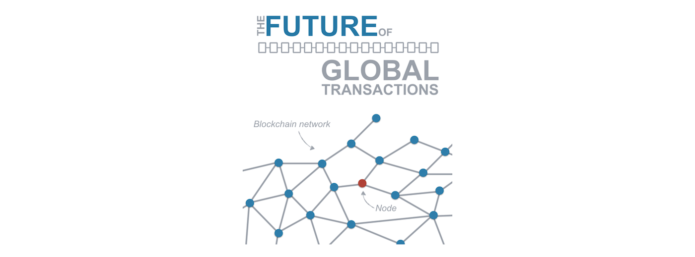
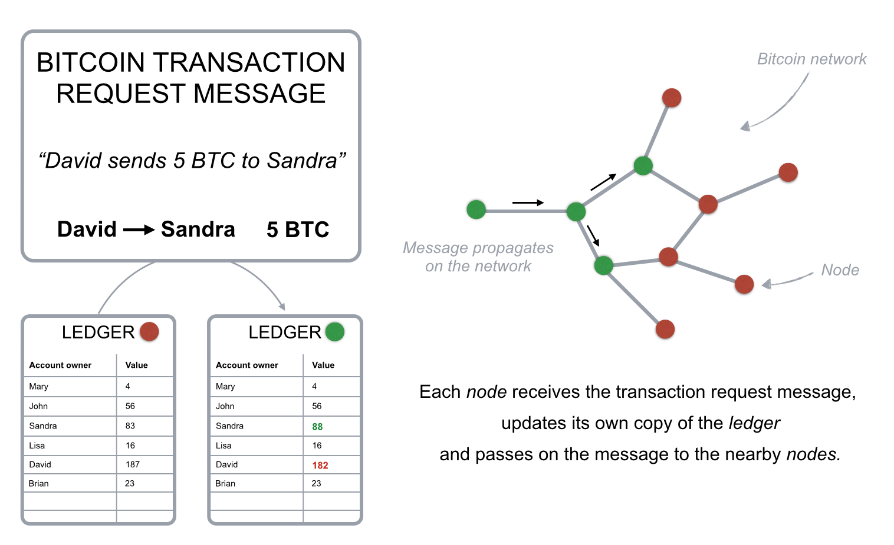
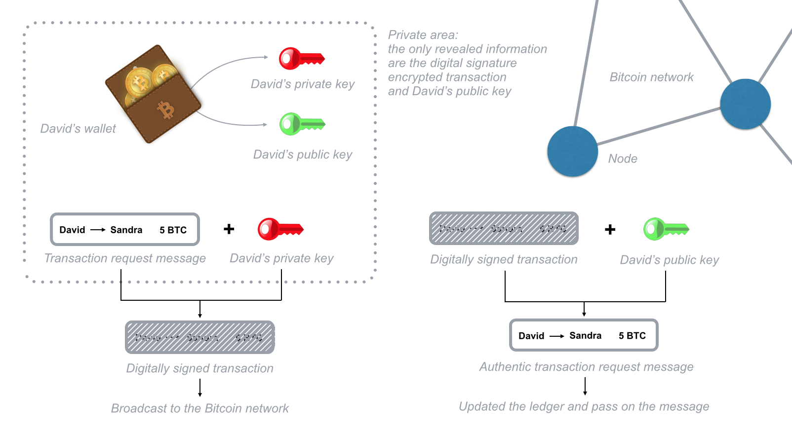
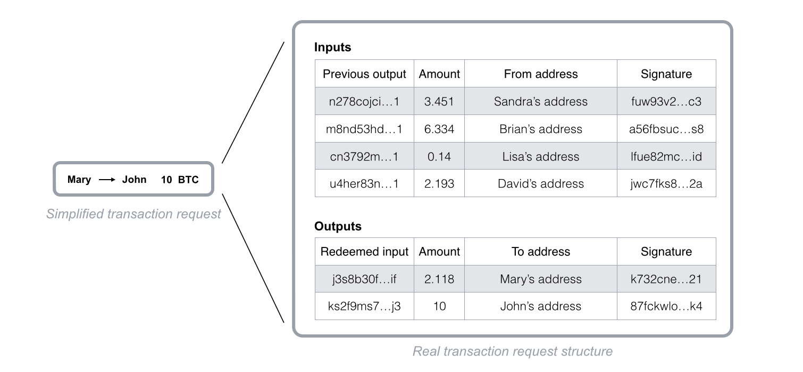
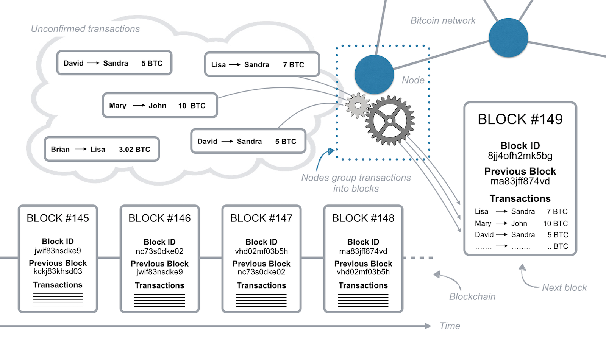
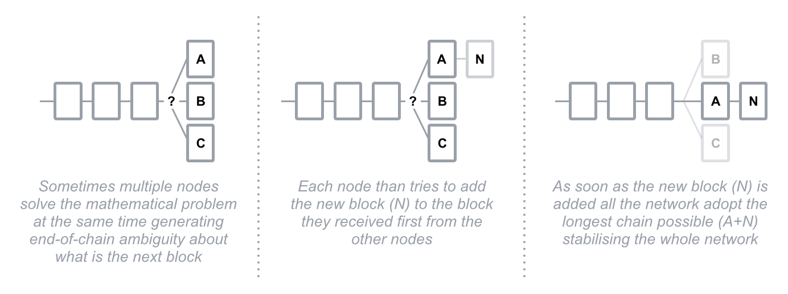
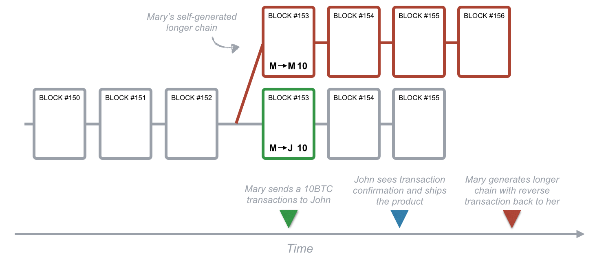
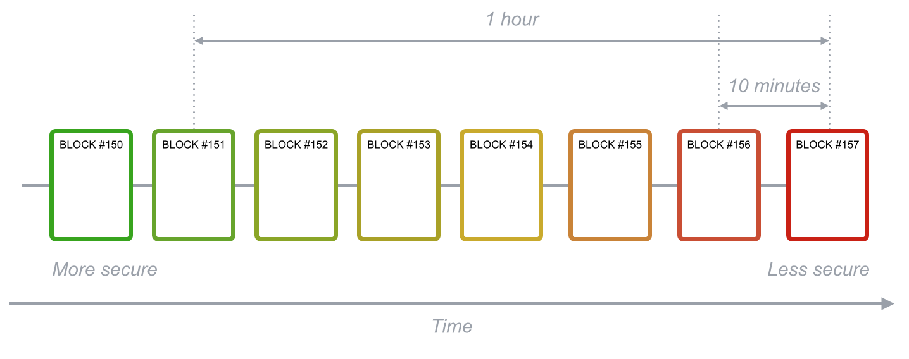

## 区块链如何工作？- - 用大白话讲解区块链技术

本文原文为 Medium 上一篇优质的区块链文章，题目为《[How Does the Blockchain work](https://medium.com/s/story/how-does-the-blockchain-work-98c8cd01d2ae)》,很多人一直想弄明白到底什么是区块链？以及区块链是如何工作的？我想这篇文章绝对可以帮你解答疑惑。

为了方便中文世界的读者更好的理解作者的意思，我在翻译的同时加入了很多通俗化的解释，有些地方跟原文也有比较大的不同，希望这篇文章可以帮助读者更好地理解区块链是如何工作的。

区块链技术也许是互联网自身演化出来的最好的发明，它让数据在不借助任何中心认证服务的前提下，以极低的信任成本完成交易。试想一种场景，我和你以50美金为赌注，赌旧金山明天的天气，我赌晴天，你赌下雨，那么今天我们有三个可选项：

1. 我们可以相互信任对方，不管是晴天还是下雨，输家都会给赢家50美金。如果我们是朋友，这将是一个非常好的解决方式，然而现实情况是，不管是朋友还是陌生人，都极有可能出现一方违约。
2. 我们可以将赌约写入合约中，并由双方都认可的机构公证。然而一旦有一方违约，赢者不得不支付额外的诉讼费用和漫长的诉讼流程，对于小额交易来说，这绝不是一种最优的解决方案。
3. 我们可以委托一个中立机构，双方各抵押50美金给第三方，赢家将会得到这两笔钱，但是我们要时刻提防第三方携款跑路的情况。

不管是信任机构还是合约都不是最优方案，陌生人信任成本太高，诉诸合约则需要时间和金钱，区块链技术有趣的地方就在于它为我们提供了一个安全、快捷、便宜的解决方案。

我们可以在区块链上写一段上述赌约的合约代码，程序会安全地保管双方的50美金，并且自动检测明天的天气情况，然后将100美金支付给赢家。双方都可以审核合约的逻辑，一旦合约部署到区块链上，它将无法被更改或者停止，也许你会觉得对于50美金的赌约有些小题大做，但如果是交易房产和公司呢？

以上并没有从技术层面上解释区块链如何工作，但是已经呈现了区块链的大致面貌和运行逻辑。

### 比特币的基本原理

最被人所知且讨论最多的区块链应用无疑是比特币，比特币是一种可以被用来作为交易媒介支付产品和服务的数字货币，就像美元、欧元、人民币以及其他国家法币。接下来我会通过第一个区块链应用来详细分析区块链是如何工作的。

>  比特币第一次给了我们一种可以从一个互联网用户传输唯一数字信息给另一个互联网用户的方式，这种传输方式可以保证足够得安全，每个人都相信传输会发生，没有人会挑战传输的合法性，这种突破性的进展很难被夸大吹嘘。          
>  —— Marc Andreessen

#### 数字账本

一个比特币就是一个BTC数字货币单元，就像美元一样，一个比特币自身没有价值，它的价值来自于我们都同意用它来交易商品和服务，同时我们也相信别人会做同样的事情。

为了记录每个人拥有的比特币数量，区块链使用了一个包含所有交易信息的数字账本。这个账本文件不会像银行或者中心化数据中心，将数据存储在中心化的服务器上。它通过互联网被分布式地存储在全世界各个地方的私人计算机（也叫节点）上，每个节点都会在本地存储一份复制账本。

如果 David 想要发送比特币还给 Sandra ，他将向网络中广播一条信息，该信息指示他的账户应该减少 5BTC，同时 Sandra 的账户将会加上相同数量的 BTC。每个网络中的节点都会收到信息，并且针对本地账本执行这条交易请求，更新各个账户的余额。

分布式的计算节点维护同一账本相比类似银行的中心化服务有以下几个特点：

1. 在银行系统中，我们只能知道自己的交易记录和账户余额；在区块链上任何人都可以看到其他人的交易信息。
2. 当你习惯信任并依赖银行系统，比特币由于其分布式特性，在出现问题时，并没有提供客服电话和帮助请求。
3. 区块链被设计为通过特殊的数学算法和代码来保证其安全性，故而不需要中心化的信任机构。

#### 公私钥

我们可以定义区块链是一个允许一群相互连接的计算机共同维护同一份安全账本的系统。为了在区块链上发送和处理交易，你需要一个可以存储和交易比特币的钱包软件，钱包通过一对唯一且关联的公私钥和加密学方法保证其安全性。

如果一条信息被指定的公钥加密，那么只有拥有相应私钥的人才能解密读取信息，反过来也是同样的道理，如果你用自己的私钥加密数据，那么也只能是相应的公钥才能解密数据。如果 David 想要发送交易，他需要通过自己钱包中的私钥对交易信息加密并广播到网络中。由于只有 David 知道私钥，所以也只有他才能发送钱包中的比特币。网络中的每个节点都可以通过公钥来解密交易信息以判定交易是否是由 David 发送。

当你用钱包私钥加密一个交易请求数据，实际上是生成了一个数字签名，该数字签名可以被区块链中的节点验证交易的合法性和所有权，数字签名是交易数据和私钥一起加密后得到的字符串，故而一个数字签名只能对应一笔交易。如果你更改了交易数据中的一个字段，得到的数字签名就会完全不同，因此可以防止重放攻击或者人为更改交易金额。

为了必须要发送比特币交易，你需要用钱包中的私钥进行签名，唯有如此你才能证明这些比特币属于你，所以私钥非常重要，千万不能对任何人泄露，否则资产就极有可能被盗。

### 获取钱包账户余额

区块链中的每个节点都维护着同一份账本，那么，节点如何知道某一个账户的余额呢？事实上区块链并不记录每个账户的余额，它只记录每一笔验证并确认过的交易。对于钱包来说，它需要分析某个账户在区块链上发生的过往所有历史交易，然后计算获得最终的账户余额。

Mary 如果想要发送10BTC给 John，她必须要找到自己并未使用过的输入链接（也称为UTXO Unspent Transaction Output）来拼装出一笔至少大于10BTC 的交易请求， 网络中的节点会验证金额是否正确，UTXO是否未被使用。UTXO 一旦使用过，未来就不能再使用了，这就如同你在支付宝上花出去的一笔钱，就只能成为交易记录，而不能再被花一次。

那么系统如何验证输入的交易有效呢？事实上系统会验证交易请求中给出的所有跟当前账户相关的UTXO，为了加速验证过程，每个节点都会保存 UTXO，正是这些安全验证算法，保证了比特币不会出现双花。拥有比特币意味着数字账本中包含跟你账户相关的UTXO，由于交易记录是透明开源的，任何人都可以看到每个账户的交易情况。

还记得上文提到区块链是分布式系统，没有客服电话或者人员帮你找回因为忘记钱包密码而丢失的交易和资产，故而使用比特币官方的开源钱包软件来保存私钥会更安全一些。

### 但是它真的安全吗？以及为什么被称为区块链呢？

任何人都可以通过互联网访问区块链网络，也可以通过账号地址查询相关的交易记录，如果有人一直使用同一个账号地址来发送和接收交易，那么将很容易将所有的交易对应到同一个账号拥有者。比特币网络允许你在钱包中生成任意多的账号地址，也就是私钥和公钥对。系统允许你使用不同的账号发送和接收交易，没有人能同时知道你所有的账号和私钥，除非你一直使用用一个私钥和地址发送交易。

比特币地址的全部可能性是2¹⁶⁰ 或者 1461501637330902918203684832716283019655932542976。这个天文数字保证了比特币出现两个相同地址的概率几乎为零。

比特币网络可能还会出现安全漏洞，那就是多次使用已经使用过的比特币。由于交易可能通过不同的节点被发送到区块链网络中，所以两笔不同的交易到达同一个节点的顺序有可能不同。攻击者发送一笔交易后，随后又很快发一笔相反的交易，将收款地址指定为自己的某一个账户地址，由于网络延时和节点分布广泛，此时有些节点就有可能会先收到后一笔交易请求，由于两笔交易用的是同一个UTXO，所以节点就会认定第一笔交易引用了已使用过的UTXO，进而认为交易无效。于是很多人想到了使用发交易时刻的时间戳来标记交易顺序，当时这种方法也很容易被攻击，毕竟时间戳是很容易被篡改的。因此我们很难判定两笔交易的发送顺序，这就给了骗子和攻击者可乘之机。

如果上面的情况频繁发生，那么将会在网络节点中产生分歧，无法达成有效共识，因此区块链在设计之初就考虑到使用特定的共识机制来防止骗子的攻击。

比特币网络通过将交易分组到块中来实现对交易的排序，每一个块包含有限数量的交易，以及上一个区块的标识信息。每个块会根据时间先后顺序依次排列，形成一个链条，故而也称系统为区块链。

在同一个块中的交易被认为同时发生，而未入块的交易则说明还没有得到确认，每一个节点都有权将一定数量的交易打包到块中，并且将打包后的块广播到网络中，求得其他节点的认可，成为链上的新块。那么这里就会有一个问题，既然每个节点都可以打包交易，那么到底以谁打包的块为准呢？

想要将自己打包的块加入到链条中，每一个块必须包含一个复杂数学问题的答案，这个数学问题是由不可逆的加密哈希函数构造而成。唯一解决这个数学问题的方式就是根据前一个块的信息，添加随机信息，然后不停地计算哈希结果，直到满足系统给出来的目标值。对于一台普通的计算机，这样的计算难度可能需要消耗一年的时间。正是通过调整目标值，以及各个节点为了竞争打包区块权而提供硬件性能，比特币系统可以维持在10分钟出一个块。

优先计算出正确答案的节点，会将答案放入新块并广播到网络中，其他节点可以将答案带入函数中，验证过程非常简单快速。这就如同在你不知道密码锁的密码时，你需要不停地试，非常耗时间，但是一旦你知道答案后，验证就非常简单了。

如果两个节点同时算出答案并将自己打包的块广播到网络中，结果会如何呢？在这种情况下，两个节点都会将自己打包的块放置在区块链的最末端，而对于其他节点也是优先验证并认可第一个达到的块。不过比特币系统有一个原则，那就是每一个节点永远都只会认可最长的链，当网络中的其他节点收到上一个区块后，会立马投入到下一个区块的打包过程中，一旦打包成功，就会立马将新块追加到链末端。而对于那些一直没有打包成功的节点来说，只需要记住选择最长链就行，这样系统即便会出现短暂的分歧，但是最终还是只会有唯一的一条主链。

同一时间打包成功同一区块的概率很低，因此系统不可能频繁出现同一时间处理多个区块的情况，所以比特币系统可以在很快的时间内针对同一条主链达成共识。

在特定时间区块出现分歧也很容易被攻击者利用，如果一笔交易所在的区块处于相对短的链中，一旦下一个区块确定，也就是最长链确定后，那么这笔交易就会立马变成未被确认的交易。在比特币系统中，交易的安全性是由加密和算法机制保证的，任何的攻击几乎都是在与整个网络做对抗。

接下来我们不妨通过一个例子看一下 Mary 是可以如何利用短暂的区块分歧来进行双花攻击的。Mary 付给 John 比特币以换取 John 的产品，因为比特币网络节点总是以最长链为最终确定的主链，如果Mary 可以依靠自己的算力生成比较长的链，然后将一笔相反的交易包含在其中，那么 John 将会同时失去本应得的比特币和自己的产品。

那么系统如何阻止这类攻击呢？事实上每次链上添加新块都不是 Mary 一个人说了算的，她需要和别人一起计算复杂数学题来获取打包区块的权力，如果她拥有强大的算力，保证每一次都能打包成功，那么她确实可以轻易地发动攻击，因为她完全可以将对自己有利的交易放入自己打造的最长链中。但是比特币网络中的很多节点都想拥有打包区块的权力，所有人都会和 Mary 竞争，换言之，如果Mary 想要实现她的攻击行为，就意味着要和整个网络的算力对抗，这个算力成本将会非常高，高到需要她掂量一下攻击是否还有利可图。

如果退一步，Mary 并不奢望每一次都能获取到打包权力，只需要保证自己希望的交易落在最长链即可。那么就意味着Mary掌握的算力要保证她在恰当的时间内，在后续的数次区块打包竞争中都能获胜，这个算力成本要求也非常高，道理也是类似的，你也许能在某一次区块打包竞争中获胜，但是要保证接下来连续的数次打包中都能获得打包权，依然要面临着对抗全网算力的压力。

总之，Mary 需要拥有全网50%以上的算力才能达到她的攻击目的，即便她能做到，她也只有25%的几率在一条链上获得连续两个区块的打包权。她想要在同一条链上获得越多区块的打包权，成功的几率就越低。所以比特币网络中的交易是依靠系统的数学竞赛来保证其安全性的，在这场竞赛中，攻击者要面临对抗整个网络算力的压力。

因此交易会随着后续区块的增加而变得更加安全，因为每个区块都会保存上一个区块的唯一标识信息，下一个区块也会保存当前区块的唯一标示信息，而且一旦区块数据有任何更改，那么其后区块所保存的标识信息就必须跟着更改。如果更改其中一个区块，并且想要获得其他节点的认可，攻击者就必须同时要重新计算该区块后面所有区块的数据，以保证相互之间留存的标识信息都是对的，每一次的篡改都意味着要和别人竞争打包权。

在比特币网络中，每次出块的平均时间间隔是10分钟，一笔交易通常认为1小时，也就是6个区块打包完成后，才算得到真正确认，因为同时破解6个区块对算力的要求是非常高的。

### 比特币挖矿

为了发送比特币，用户需要引用钱包中已有的UTXO，也就是未使用的交易输入，并且将交易发送到全网进行广播，那么第一笔比特币从哪里来呢？或者说第一个UTXO从哪来呢？

为了平衡由于网络异常或者钱包私钥丢失，而导致的全网经济通缩，系统会给每一次通过计算数学难题获得打包权的人新币奖励，这种为了获得比特币奖励而运行比特币软件的行为被称为“挖矿”，这种行为很像现实生活中的挖金矿。

比特币奖励成为了很多人运行节点的动力，他们愿意为此付出一定的算力以保证可以处理交易，并且维持整个比特币网络的稳定。

因为单靠一台普通计算机计算打包数学难题至少需要耗费非常长的时间，于是很多节点就会联合起来共同破解计算难题，这样他们解决难题的几率就会大很多，然后再根据各自的算力分配奖励，这种联合打包的组织也被称为“矿池”。

一些矿池的算力非常大，大到其算力已经超过全网算力的20%，正如上文提到的双花攻击，他们俨然已经成为比特币全网安全的隐患，不过即使他们其中的矿池未来拥有超过50%的算力，那么只要累加的区块足够多，历史交易依然是足够安全的。当然有很多矿池也在限制算力的继续增加，以保证比特币全网的安全。

随着计算机硬件性能的提升，比特币网络中节点的算力也会越来越高，不过系统会自动根据全网算力动态调整数学题的计算难度，以保证大概平均10分钟的出块时间，这点同样可以保证全网的稳定性和安全性。

此外，比特币每隔四年挖矿奖励就会减半，因此比特币挖矿将会逐渐失去吸引力，为了鼓励节点继续维持比特币网络，每一笔交易都会包含一笔小额交易费用以奖励打包区块的矿工。所以对于挖矿成功的矿工来说，会同时收到区块中所有交易的手续费和系统奖励的新币。手续费的意义还在于矿工会有优先处理那些愿意支付更高手续费的交易，通过市场调节的方式使得交易手续费处于合理的区间。比特币现有的交易手续费相比传统银行来说，要低得多，而且手续费跟交易金额没有关系。

### 区块链的优势和挑战

现在你已经对区块链如何工作有了全面基本的认识了，接下来让我来快速看一下为什么它如此有趣。

使用区块链技术有如下显著的优势：

* 你将对你的资产和数据拥有绝对的所有权，没有第三方机构可以控制你的资产和数据，或者限制你的访问权限
* 在区块链上给任何其他人发送数据成本非常低，它允许大量的小额支付
* 数据可以在几分钟内发送完毕，并且交易可以在数小时内被确认安全无误，而不是几天或者几周
* 任何人可以在任何时候验证区块链上任意一笔交易，交易结果对所有人来说都是透明的
* 利用区块链技术使得构建去中心化的应用成为可能，同时还可以保证信息被高效安全地处理和传输

然而，区块链技术依然有一些挑战：

* 区块链使得交易可以以匿名的方式在链上发送和接收，虽然保护了隐私，但也吸引了很多非法的活动
* 虽然出现了很多交易所，并且数字货币也变得非常流行，但是到今天依然很难用比特币购买商品和服务
* 和其他加密货币一样，比特币的供应是有限的，市场上没有足够多有效的流动性，而市场需求又是在快速变化的。同时比特币的价格也是不稳定的。

总之，区块链技术未来有极大的潜力会重构其他行业，从传统的广告业到能源供应。它最大的优势在于可以形成去中心化的生态，降低交易和信息成本。

新的技术每天都在发生和迭代，例如可以提供去中心化应用的智能合约平台以太坊。但是请记住区块链技术依然处于早期实验阶段，各种用于改善和提升区块链安全的技术和工具层出不穷，未来区块链将会在更多的产品、工具和服务上体现其价值，让我们拭目以待。

